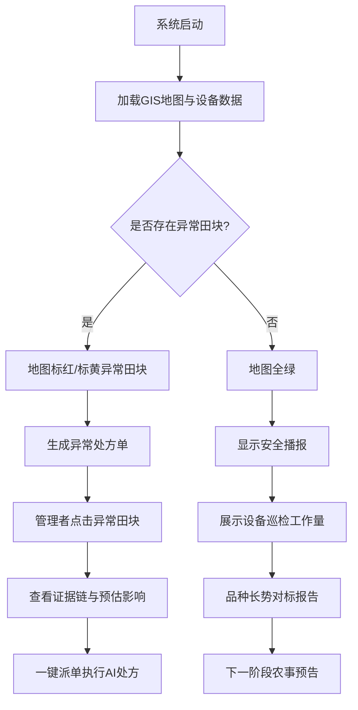

## 1. 产品概述

邗江区无人农场网格化农情大屏指挥中心，面向农场管理者与农技人员，基于GIS地图可视化与"例外管理"逻辑，实现300亩农田、数十个田块、3-4个品种混种场景下的实时监控、异常预警与智能处方。系统以"红绿灯"农田地图为核心，让管理者一眼识别异常田块，一键获取AI智能处方。

- 核心价值：从"文字堆砌"升级为"空间维度的作战地图"，种植户看报告如"看体检报告"，只关心哪里有雷、损失多大、怎么排雷
- 目标用户：农场管理者、合作社理事长、农技人员

## 2. 核心功能

### 2.1 用户角色
| 角色 | 核心权限 |
|------|----------|
| 农场管理者 | 查看全局概览、异常预警、一键派单、AI分析 |
| 农技人员 | 查看田块详情、监测数据、处方建议 |

### 2.2 功能模块
1. **GIS农田地图**：红绿灯田块着色、田块点击详情、品种分布标注
2. **全局概览面板**：总亩数、异常田块数、设备在线率、今日预警数
3. **异常田块处方单**：按危急程度排序、异常证据链、预估影响、一键派单
4. **设备监测矩阵**：鹰眼、球机、墒情仪、虫情灯等设备状态与数据
5. **品种长势对标**：扬麦25/宁麦13/镇麦12分品种长势曲线与标准对比
6. **气象预警预告**：未来天气、风险预警、预防处方
7. **AI智能分析**：农情AI助手、异常根因分析、作业方案推荐、产量预测

### 2.3 页面详情
| 页面区域 | 模块名称 | 功能描述 |
|----------|----------|----------|
| 中央区域 | GIS农田地图 | SVG交互地图，田块红/黄/绿着色，点击弹出田块详情，显示品种、监测数据、异常信息 |
| 左上 | 全局概览 | 4个统计卡片（总亩数/异常田块/设备在线/今日预警），数字滚动动画 |
| 左中 | 异常处方单 | 按危急程度排序的异常田块列表，含证据链、预估影响、一键派单按钮 |
| 左下 | 设备监测 | 设备在线状态矩阵，鹰眼/球机/墒情仪/虫情灯数据摘要 |
| 右上 | 品种长势对标 | 3个品种长势曲线图与标准曲线对比，LAI/LNC指标 |
| 右中 | 气象预警 | 7日天气预报、风险等级、预防建议 |
| 右下 | AI分析面板 | AI对话助手、快捷分析场景、智能推荐 |
| 顶部 | 标题栏 | 系统名称、当前时间、全局状态指示灯 |

## 3. 核心流程

## 4. 用户界面设计

### 4.1 设计风格
- **主色调**：深空蓝(#0A1628) + 科技青(#00D4FF) + 警示红(#FF4757) + 安全绿(#1DB954) + 预警黄(#FFD93D)
- **辅助色**：深蓝(#1E3A5F)、浅蓝(#8899B0)、金色(#D4A843)
- **字体**：标题用 DIN Alternate / Orbitron（数字科技感），正文用 Noto Sans SC
- **布局**：大屏三栏布局（左-中-右），中央为GIS地图，两侧为数据面板
- **动效**：粒子背景、扫描线、脉冲发光、数字滚动、地图田块呼吸动画
- **图标**：线性SVG图标，科技风格

### 4.2 页面设计概述
| 页面区域 | 模块名称 | UI元素 |
|----------|----------|--------|
| 顶部标题栏 | 系统标题 | 渐变文字标题、实时时钟、系统状态灯、扫描线装饰 |
| 中央地图 | GIS农田地图 | SVG田块多边形、红/黄/绿着色、田块标签、设备点位、点击弹窗 |
| 左侧面板 | 数据面板 | 玻璃态卡片、数字滚动、进度条、设备状态矩阵 |
| 右侧面板 | 分析面板 | 折线图、气象卡片、AI对话面板、快捷按钮 |

### 4.3 响应式
- 大屏优先（1920×1080），适配PC（1366×768）
- 平板端：面板可折叠，地图全屏
- 手机端：纵向布局，地图在上，面板在下可滑动

### 4.4 动效设计
- 粒子背景：深空蓝底色+缓慢漂浮粒子
- 扫描线：标题栏底部水平扫描线
- 田块呼吸：异常田块边框脉冲发光
- 数字滚动：统计数字从0滚动到目标值
- 地图交互：悬停高亮、点击弹出详情
- AI打字效果：AI回复逐字显示
