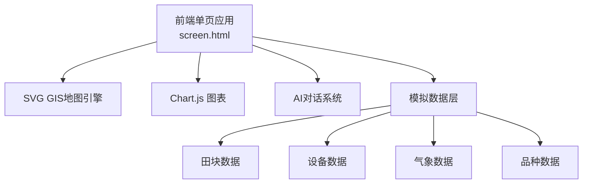

## 1. 架构设计



## 2. 技术说明
- 前端：纯HTML + CSS + JavaScript（单文件架构，与现有项目一致）
- CSS框架：Tailwind CSS（CDN）
- 图表：Chart.js（CDN）
- 字体：Orbitron（数字/标题）+ Noto Sans SC（正文）
- 数据：前端模拟数据，无需后端
- 无需构建工具，直接浏览器运行

## 3. 路由定义
| 路由 | 用途 |
|------|------|
| /screen.html | 大屏指挥中心主页面 |

## 4. 数据模型

### 4.1 田块数据
```javascript
{
  id: "east-03", name: "东区-03号田", variety: "扬麦25",
  area: 12, status: "red|yellow|green",
  anomaly: "东北角约2亩异常发黄", evidence: "鹰眼识别+长势仪LNC极低",
  impact: "千粒重将下降15%，预估损失约300斤",
  prescription: "调度植保无人机，高浓度叶面肥变量喷洒",
  center: {x, y}, points: [{x,y}...]
}
```

### 4.2 设备数据
```javascript
{
  id: "eagle-01", name: "鹰眼-01", type: "鹰眼",
  status: "online|offline|alert",
  lastData: "12次全景巡航", position: {x, y}
}
```

### 4.3 品种数据
```javascript
{
  name: "扬麦25", area: 120, stage: "扬花-灌浆期",
  lai: 5.2, lnc: 3.8, standardLai: 5.0,
  status: "正常", yieldEstimate: "98%"
}
```

## 5. 关键交互

### 5.1 地图交互
- 点击田块：弹出详情弹窗（品种、监测数据、异常信息、处方）
- 悬停田块：高亮边框+显示田块名称tooltip
- 一键派单：点击后显示派单成功动画

### 5.2 AI助手交互
- 右下角FAB按钮，点击弹出AI面板
- 快捷问题：异常根因分析、作业方案推荐、产量预测、气象风险
- 关键词匹配回答，支持打字效果
- 全屏模式

### 5.3 场景切换
- 异常模式（默认）：地图显示红/黄田块，处方单高亮
- 正常模式：切换按钮，地图全绿，显示安全播报
