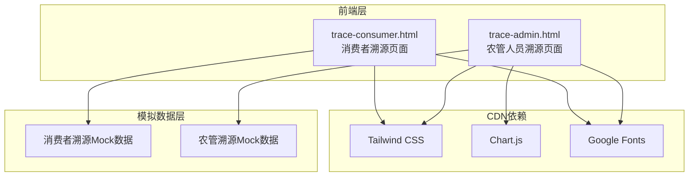

## 1. 架构设计



## 2. 技术说明

- **前端**：纯HTML + CSS + JavaScript，单文件架构
- **样式框架**：Tailwind CSS (CDN)
- **图表库**：Chart.js (CDN)，仅农管端使用
- **字体**：Noto Serif SC + Noto Sans SC (Google Fonts CDN)
- **后端**：无，使用Mock数据模拟
- **数据**：内嵌JSON格式模拟数据

## 3. 路由定义

### 消费者端 (trace-consumer.html)

| 锚点路由 | 用途 |
|----------|------|
| #home | 溯源查询首页 |
| #detail | 产品溯源详情页 |
| #timeline | 种植过程时间线 |
| #quality | 质检报告 |
| #logistics | 物流追踪 |

### 农管人员端 (trace-admin.html)

| 锚点路由 | 用途 |
|----------|------|
| #dashboard | 溯源总览仪表盘 |
| #batch | 批次管理 |
| #quality | 质量监控 |
| #supply | 供应链追踪 |
| #ai | AI智能分析 |

## 4. 数据模型

### 4.1 消费者端数据结构

```javascript
var productData = {
  traceCode: "HJ20250507001",
  name: "邗江有机大米",
  category: "粮食",
  origin: "江苏省扬州市邗江区",
  farm: "邗江无人农场示范基地",
  plantDate: "2025-03-15",
  harvestDate: "2025-05-01",
  shelfLife: "12个月",
  certifications: ["有机认证", "绿色食品", "ISO22000"],
  qualityScore: 98.5,
  timeline: [
    { stage: "播种", date: "2025-03-15", desc: "精选南粳46号种子，智能精量播种", icon: "seed" },
    { stage: "施肥", date: "2025-03-20", desc: "有机肥施用，AI精准配比", icon: "fertilizer" },
    { stage: "灌溉", date: "2025-04-01", desc: "智能灌溉系统，节水30%", icon: "water" },
    { stage: "植保", date: "2025-04-10", desc: "无人机植保，生物防治", icon: "shield" },
    { stage: "收割", date: "2025-05-01", desc: "无人收割机自动作业", icon: "harvest" },
    { stage: "加工", date: "2025-05-02", desc: "低温烘干，精细加工", icon: "process" },
    { stage: "质检", date: "2025-05-03", desc: "农残/重金属全项检测合格", icon: "check" },
    { stage: "物流", date: "2025-05-05", desc: "冷链运输，全程温控", icon: "truck" }
  ],
  qualityReports: [
    { item: "农药残留", result: "未检出", standard: "GB 2763-2021", status: "pass" },
    { item: "铅(Pb)", result: "0.02mg/kg", standard: "≤0.2mg/kg", status: "pass" },
    { item: "镉(Cd)", result: "0.01mg/kg", standard: "≤0.2mg/kg", status: "pass" },
    { item: "黄曲霉毒素B1", result: "未检出", standard: "≤5μg/kg", status: "pass" }
  ],
  logistics: [
    { node: "农场仓库", time: "05-05 08:00", temp: "15°C", status: "done" },
    { node: "冷链运输", time: "05-05 10:00", temp: "4°C", status: "done" },
    { node: "区域配送中心", time: "05-06 06:00", temp: "4°C", status: "done" },
    { node: "门店上架", time: "05-06 14:00", temp: "18°C", status: "current" }
  ]
};
```

### 4.2 农管人员端数据结构

```javascript
var adminData = {
  stats: {
    totalBatches: 1286,
    todayNew: 23,
    alertBatches: 3,
    passRate: 99.2
  },
  batches: [
    { id: "HJ20250507001", product: "有机大米", status: "合格", date: "2025-05-07", score: 98.5 },
    { id: "HJ20250506002", product: "绿色蔬菜", status: "合格", date: "2025-05-06", score: 97.8 },
    { id: "HJ20250505003", product: "有机小麦", status: "待检", date: "2025-05-05", score: null },
    { id: "HJ20250504004", product: "生态水果", status: "异常", date: "2025-05-04", score: 85.2 }
  ],
  alerts: [
    { level: "high", msg: "批次HJ20250504004农残检测超标", time: "10分钟前" },
    { level: "medium", msg: "冷链3号车温度异常波动", time: "30分钟前" },
    { level: "low", msg: "批次HJ20250505003待质检超24h", time: "1小时前" }
  ],
  aiInsights: [
    { type: "risk", title: "风险预测", content: "近期高温天气，建议加强仓储温控监测，预计影响3个批次" },
    { type: "anomaly", title: "异常检测", content: "检测到2号生产线产出率下降5%，建议排查设备状态" },
    { type: "trend", title: "趋势分析", content: "本月溯源查询量环比增长23%，消费者关注度持续上升" },
    { type: "decision", title: "决策建议", content: "建议增加有机蔬菜批次抽检频率，当前抽检率低于行业均值" }
  ]
};
```

## 5. 关键技术实现

### 5.1 消费者端
- CSS自定义属性实现自然暖色调主题
- 时间线组件：CSS + JS实现渐进展开动画
- AI助手：关键词匹配 + 模拟回答
- 溯源码查询：模拟数据匹配展示
- 视差滚动效果：CSS transform实现

### 5.2 农管人员端
- CSS自定义属性实现科技蓝主题
- Chart.js图表：合格率趋势、批次分布、温控曲线
- 实时数据模拟：setInterval定时更新
- AI分析面板：预设场景 + 模拟分析结果
- 粒子背景：Canvas实现
- 数据表格：排序、筛选、分页
